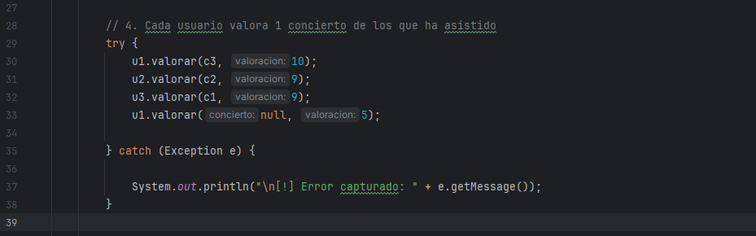
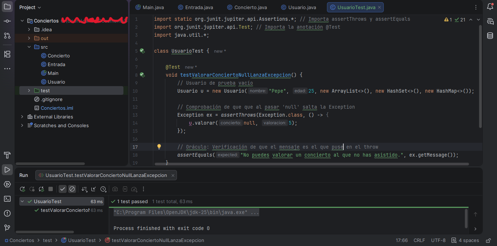
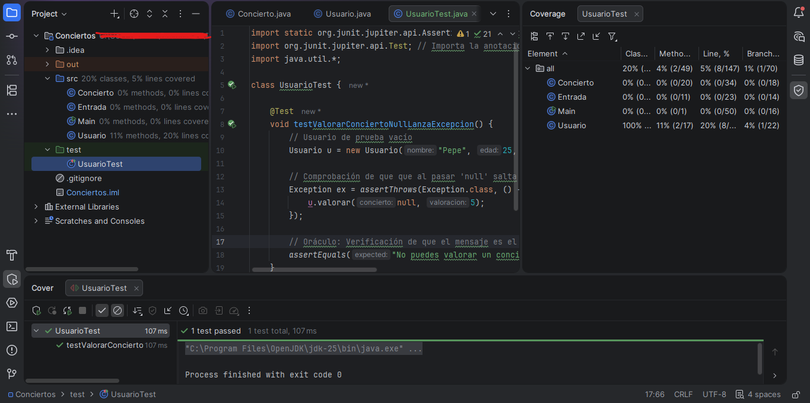

# Actividad 1: Gestión de Conciertos

## 📝 Contexto
Un cliente quiere desarrollar una aplicación para la gestión de conciertos, incluyendo la gestión de entradas y usuarios.

### Ejercicios:

#### 1. Clase Entrada
* **Atributos:** `concierto` (Concierto), `tipo` (Pista, Grada o VIP).
* **Constructores:** Completo y Vacío.
* **Métodos:** Getters/Setters, equals, hashCode y `toString()` (“Entrada de <precio total> €”).
* **Lógica:** `getPrecioTotal()` aplica recargos según el tipo (Grada: 0%, Pista: 10%, VIP: 20%).

#### 2. Clase Concierto
* **Atributos:** `artista`, `ciudad`, `precioBase`, `aforoMaximo`, `entradasVendidas` (ArrayList) y `activo`.
* **Constructores:** Completo y Vacío.
* **Métodos:** Getters/Setters, equals, hashCode y `toString()` (“Concierto de <artista> en <ciudad>”).
* **Lógica:** Cálculo de recaudación total, precio medio y verificación de disponibilidad de entradas.

#### 3. Clase Usuario
* **Atributos:** `nombre`, `edad`, `entradasCompradas` (ArrayList), `conciertosAsistidos` (HashSet), `valoraciones` (HashMap).
* **Constructores:** Completo y Vacío.
* **Métodos:** Getters/Setters, equals, hashCode y `toString()` (“<Nombre> (ha asistido a <nº conciertos>)”).
* **Lógica:** * `comprarEntrada()`: Valida que el concierto esté activo, que el usuario no haya asistido previamente y que haya aforo disponible.
    * `valorar()`: Valida asistencia previa y que la nota esté entre 0 y 10.

### Clase Main
* Creación de 3 conciertos y 3 usuarios.
* Simulación de compra de 2 entradas por usuario.
* Simulación de 1 valoración por usuario.

### Opcional (Estadísticas)
* Cálculo total de entradas vendidas (general y por tipo).
* Recaudación total y precio medio global.
* Identificación de conciertos con máximo y mínimo de ventas.

---

## 🛠️ Bonus

Además de lo especificado entre los requisitos del ejercicio, he implementado las siguientes mejoras al código relacionadas con la **UD04**:

### 1. Gestión de Errores con Try-Catch
El proceso de valoración en el `Main` se ha protegido con un bloque **try-catch** para capturar excepciones personalizadas sin detener el flujo del programa.

> **Captura de Pantalla - Implementación del Try-Catch:**
> 

### 2. Pruebas Unitarias con JUnit 6
Se ha validado la robustez del método `valorar` mediante pruebas automatizadas, asegurando que el sistema responda correctamente ante valores nulos o fuera de rango.

> **Captura de Pantalla - Clase de Test:**
> 

### 3. Análisis de Cobertura (Code Coverage)
Se ha verificado mediante la herramienta de cobertura de IntelliJ que las rutas de excepción están correctamente probadas y protegidas.

> **Captura de Pantalla - Cobertura:**
> 

---

## 🚀 Actualización: Gestión de Excepciones (Rama `testing`)

Se ha evolucionado el proyecto para implementar un sistema de control de errores robusto mediante **Excepciones Personalizadas** en el paquete `exceptions`.

### 1. Excepciones Implementadas
Se han definido y lanzado las siguientes excepciones:

* **En `Concierto`**:
    * `CeroEntradasException`: Lanzada en `calcularPrecioMedio` si el concierto no tiene ventas, evitando divisiones por cero.
* **En `Usuario`**:
    * `ConciertoInactivoException`: Si se intenta comprar para un evento desactivado.
    * `ConciertoYaAsistidoException`: Evita que un usuario compre dos veces para el mismo concierto.
    * `AforoCompletoException`: Se lanza cuando se agota el cupo del evento.
    * `ConciertoNoAsistidoException`: Impide valorar conciertos a los que el usuario no fue.
    * `ValoracionIncorrectaException`: Valida que la nota esté estrictamente entre 0 y 10.

### 2. Implementación en el Main (Handling)
Siguiendo los nuevos requisitos del ejercicio, el `Main` se han provocado y capturado todas las excepciones definidas anteriormente:
* **Provocación:** Se fuerzan situaciones de error (compras duplicadas, notas fuera de rango, conciertos inactivos) para validar el lanzamiento de las excepciones.
* **Captura:** Se utilizan bloques `try-catch` con **multi-catch** para gestionar los errores y mostrar mensajes amigables por consola, permitiendo que el programa continúe su ejecución sin colapsar.

> **Nota sobre la Rama Testing:** Todos los desarrollos relacionados con este ejercicio sobre validación de excepciones y pruebas de robustez se han realizado en la rama `testing` para mantener intacto el ejercicio original. 
